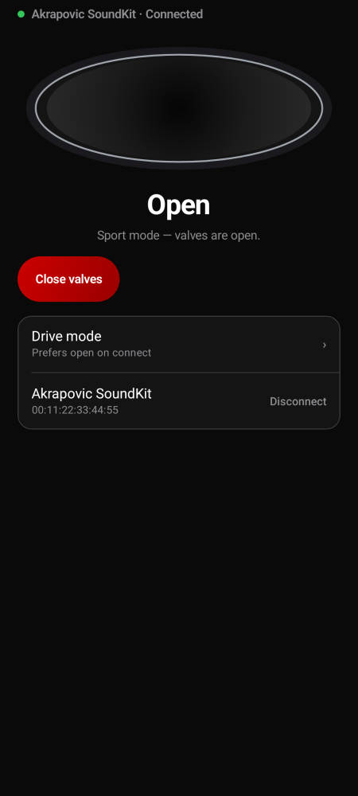
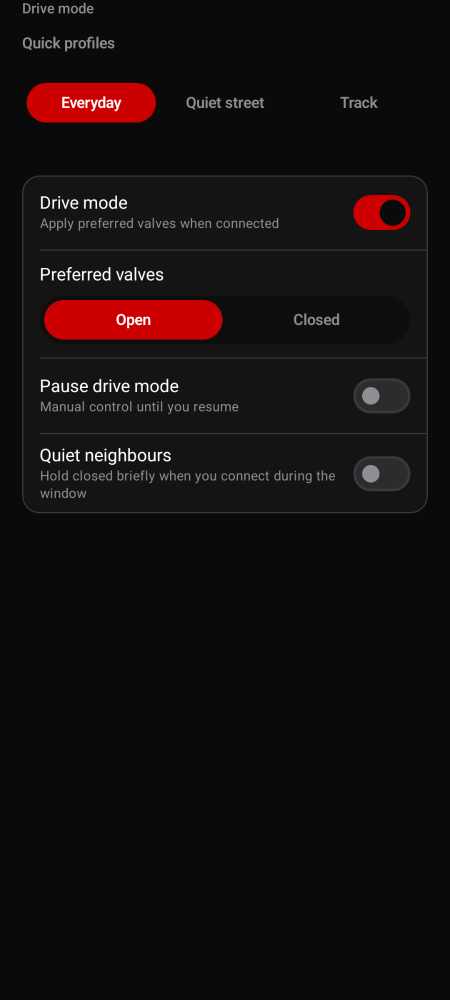
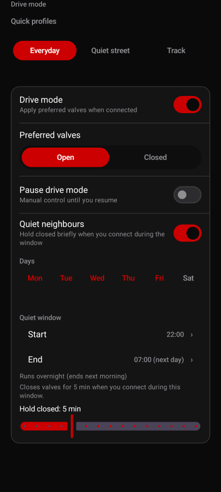
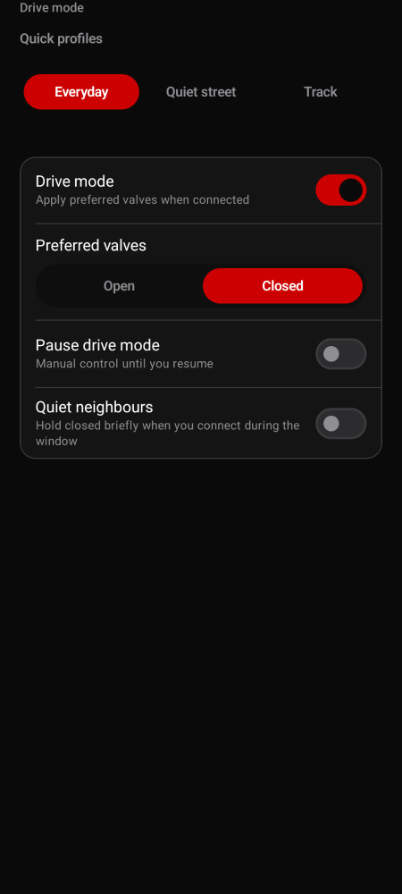
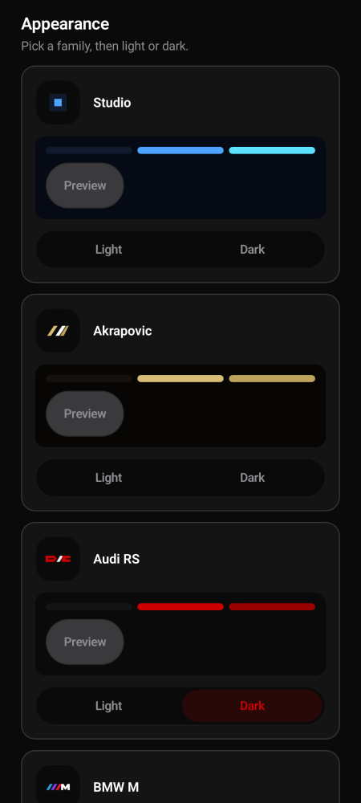
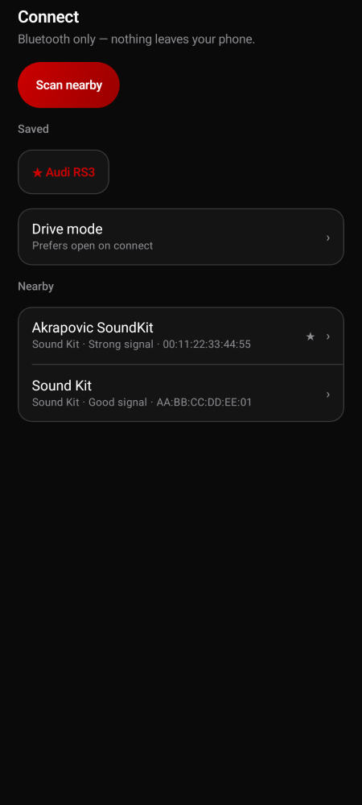
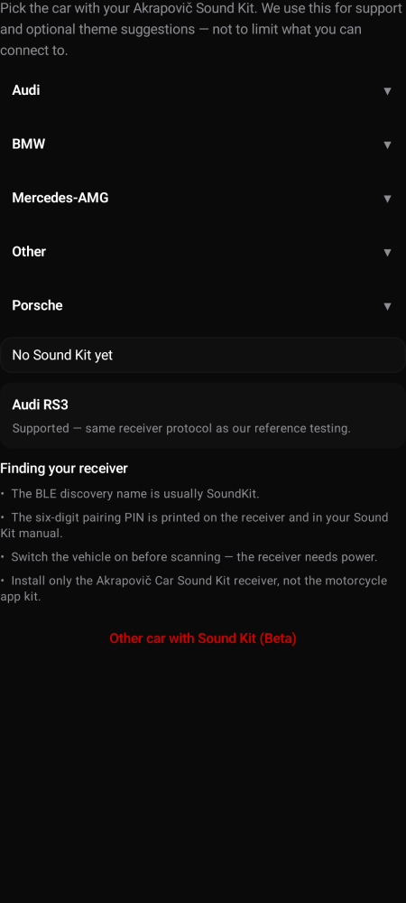

# Sound Kit Community

Open-source Android app for the Akrapovič **Car Sound Kit** BLE receiver — a maintained replacement for the abandoned official app (`si.sunesis.akrapovic.soundkit`).

**Not affiliated with Akrapovič.** Local Bluetooth only — no internet, accounts, or telemetry.

**Platform status:** **Android** is the owner-ready build (see `INSTALL.md`). **iOS** dev v1 is in the repo for developers with Xcode and a physical iPhone — not for public owner install yet (`ios/SoundKitCommunity/README.md`).

## For Sound Kit owners

**[Install guide → INSTALL.md](INSTALL.md)** · **[Download v0.3.0 →](https://github.com/lukey662/akrapovic-Soundkit-Community-Edition/releases/tag/v0.3.0)**

| Feature | What it does |
|---------|----------------|
| **Auto open / close** | Drive mode applies **Open** or **Closed** whenever you connect |
| **Quiet neighbours** | Hold valves closed for a few minutes during evening/weekend windows |
| **Audi RS theme** | Matte black + RS red — suggested when you pick Audi RS3 in setup |

<p align="center">
  
</p>

<p align="center">
  
  &nbsp;&nbsp;
  
</p>

<p align="center">
  
  &nbsp;&nbsp;
  
</p>

<p align="center">
  
  &nbsp;&nbsp;
  
</p>

**Support:** More → Advanced → Diagnostics → email **support@appsforgood.net**

---

## Why this project

The **official** Car SoundKit Android app for the Sound Kit receiver is **no longer a practical option on current Android**. The original package (`si.sunesis.akrapovic.soundkit`) is **abandoned / unmaintained**: it targets an older permission and execution model, so on **Android 12 and newer** you typically hit **Bluetooth scan/connect permission requirements**, **foreground execution expectations**, and **Play policy constraints** that the original app was never updated to satisfy. In practice, many owners cannot rely on the official app for day-to-day use on a modern phone.

**Sound Kit Community** is an **independent, open-source project**. It is **not** affiliated with, endorsed by, or supported by Akrapovič d.d. or the original publisher. It exists so enthusiasts can run a **maintained** BLE client with explicit safety guardrails and public documentation.

Visual and interaction polish is **ongoing**; see `ROADMAP.md` for planned UX work alongside product features.

## Disclaimer — Use at your own risk

By installing or using this app you acknowledge and accept that:

- This is an **independent open-source project**. It is **not affiliated with, endorsed by, or supported by** Akrapovič d.d. or the original publisher.
- The valve protocol was **reverse-engineered** from a public APK. Behavior may differ from the official app.
- Using this app may **void your exhaust, vehicle, or component warranty**.
- Operating exhaust valves can change **emissions, sound levels, and legal compliance**. You are solely responsible for following all applicable **local noise and emissions regulations**.
- **Never operate the valves while driving.** Use only when the vehicle is parked with safe ventilation.
- The app is provided **as-is**, with **no warranty of any kind**, express or implied. The authors and contributors accept **no liability** for equipment damage, legal exposure, personal injury, or any other loss arising from use.

The app shows this disclaimer once on first launch; you must accept it before any features are enabled.

## Status

The original Android APK has been statically analyzed and the core protocol is documented. The receiver uses one verified toggle payload (`01`) on characteristic `0000fff4-0000-1000-8000-00805f9b34fb`; OPEN and CLOSE in this app are state-gated so no write is sent until receiver notifications report whether the valves are currently open or closed.

See `APK_ANALYSIS.md` and `BLE_PROTOCOL.md`.

Testing strategy and the physical receiver smoke checklist are documented in `TESTING.md`.

**Vehicle support:** Any car with the Akrapovič **Car** Sound Kit BLE receiver (not motorcycle Sound Kit Custom). Audi RS3 is the reference **Supported** tier; other platforms are **Beta** until field-validated — see `COMPATIBILITY.md`.

**Support:** Export diagnostics from **More → Advanced → Diagnostics** and email **support@appsforgood.net** (Apps for Good Product Studio). Nothing uploads automatically.

**iOS:** Dev v1 SwiftUI app under `ios/SoundKitCommunity/` — full BLE parity, drive mode, and Audi theme in code; **developers only** until RS3 hardware smoke passes. Open `ios/SoundKitCommunity.xcodeproj` in Xcode. See `ROADMAP.md` for TestFlight timeline.

## Documentation

- `INSTALL.md` — owner install guide (APK, permissions, first run)
- `README.md` — overview, build, safety
- `ROADMAP.md` — planned features (favorites, rules, automations, UI/UX)
- `SPEC.md` — technical behavior
- `DECISIONS.md` — architecture decisions
- `DOCS.md` — developer workflow
- `STYLE_GUIDE.md` — code and UI conventions
- `BLE_PROTOCOL.md` / `APK_ANALYSIS.md` — protocol and reverse engineering
- `COMPATIBILITY.md` — vehicle tiers (Supported / Beta) and diagnostics submission
- `TESTING.md` — test strategy and hardware checklist

## Features

- Kotlin, Jetpack Compose, and Material 3
- MVVM + repository architecture
- Standard Android BLE GATT APIs
- Android 12+ Bluetooth permission handling
- Legacy Android 8-11 location permission handling for BLE scanning
- Foreground `connectedDevice` service
- Persistent notification actions
- Quick Settings tile
- Local diagnostics log and export
- Local-only Android Auto IoT template surface
- Hilt dependency injection
- DataStore settings
- Debug Timber logging

## Build

**Owners:** see `INSTALL.md` — you do not need Android Studio.

**Developers:** install Android Studio with Android SDK 35 and JDK 17, then from the repository root run:

```bash
./gradlew :app:assembleDebug
```

The debug build runs JVM unit tests first and fails before packaging if they fail.

The debug APK is generated at:

```text
app/build/outputs/apk/debug/app-debug.apk
```

## Sideload

Enable USB debugging on the test phone, connect it, then run:

```bash
adb install -r app/build/outputs/apk/debug/app-debug.apk
```

Grant the requested Bluetooth permissions when prompted.

## Safety

Test while parked. Do not send unknown BLE payloads to the receiver. This app only sends the verified toggle command when the receiver state is known and the requested state requires a change.

## Android Auto

Android Auto support is implemented as a local-only **IoT** Car App template surface:

```text
Android Auto screen -> phone CarAppService -> phone BLE service -> Sound Kit receiver
```

Google’s IoT category supports **projected Android Auto** (phone USB/wireless) and **Android Automotive OS** built-in head units. Because this is a sideloaded valve controller, it will **not** appear in the car launcher until you configure **Android Auto in system Settings** on the phone (there is usually no standalone launcher icon on modern Android):

1. **Pixel:** Settings → Connected devices → Connection preferences → **Android Auto** (or search Settings for “Android Auto”)
2. Developer mode (tap **Version** 10× in Android Auto settings)
3. **Unknown sources** in AA developer settings
4. **Customize launcher** → enable Sound Kit (on newer AA builds)

See **More → Android Auto** in the app and `DOCS.md` § Android Auto Testing for the full checklist. Diagnostics exports include a **CAR APP READINESS** section.

**Play Store listing** for projected Android Auto remains out of scope (policy). Sideload + developer mode is the supported personal path. If the car launcher never lists Sound Kit, use the foreground notification or Quick Settings tile while connected.

This does not use the internet.
