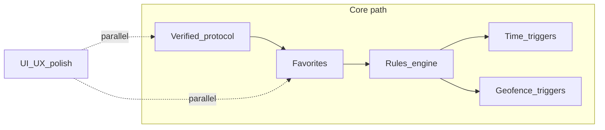

# Roadmap

Living plan for **Sound Kit Community**. Nothing here is a commitment or timeline; it records direction so contributors and users know what might come next. All work stays **local-first** (phone BLE only) unless an explicit decision says otherwise.

## Principles

- **Safety first** — No silent automation that could surprise a driver. Clear manual override, visible “why did the valve change?” affordances where automation exists.
- **Fail-closed protocol** — Automation that sends valve commands must only run when `BLE_PROTOCOL.md` is verified and `SoundKitProtocol` allows writes.
- **Privacy** — Geofencing and location-backed rules need **opt-in**, plain-language disclosure, and minimal retention. No selling or sharing location data (there is no backend today).
- **Accessibility** — Target **WCAG 2.1 AA** for contrast, semantics, touch targets (≥48dp), and screen reader labels as screens are touched.

## Near term (foundation)

| Area | Intent |
|------|--------|
| **Verified BLE protocol** | Capture UUIDs, payloads, write type, bonding, notify behavior; document evidence in `BLE_PROTOCOL.md`; enable guarded OPEN/CLOSE in app. |
| **CI reliability** | Ensure Gradle wrapper JAR is present so GitHub Actions can run `./gradlew` without bootstrap failures. |

## UX / UI (cross-cutting, parallel)

These improvements can advance **alongside** protocol work. Early passes do not require verified writes.

- Extend the **industrial / amber HUD** language from the scan shell to **Connected**, **Diagnostics**, and **Settings** (see `STYLE_GUIDE.md`).
- **Empty, loading, and error** states on every screen with recovery actions (retry scan, open settings, copy diagnostics).
- **First-run onboarding** — short flow for Bluetooth permissions, notifications (foreground service), and battery optimization guidance (already partially in settings; unify the story).
- **Motion and haptics** — subtle, optional; never required to complete a task.
- **Accessibility audit** — TalkBack order, content descriptions, focus visible states.

## Product features

### Favorites and saved devices

- Pin or star receivers, **nicknames**, sort order.
- Optional **default device** and “connect on launch” (with clear disconnect and permission boundaries).

### Rules engine

- Persistent **rules**: when [triggers] then [actions] (e.g. open / close valve), with **precedence** and conflict resolution.
- Storage likely evolves from DataStore to **Room** or similar if rule complexity grows.

### Time-based automation

- **Schedules** — time windows, quiet hours vs “sport” hours, timezone-safe recurrence.
- Use **WorkManager** or **AlarmManager** with careful respect for **Doze** and **exact alarm** policy; tie execution to **connected BLE** state and user-visible last-run log.

### Geofencing automation

- **Geofence enter/exit** as triggers (Android **Geofencing API**).
- Requires **location permissions** (and possibly background location for some scenarios — high scrutiny on Play; document and gate).
- **Foreground service** may be needed for reliable BLE + geofence together; battery impact called out in UI.

### Notifications and Quick Settings

- Deep links to **pause all rules**, show **last automation cause**, quick manual OPEN/CLOSE when connected.

## Non-goals (for now)

- **Cloud** accounts, remote control over the internet, or telemetry backends.
- **Warranty** or official integration with Akrapovič systems.

## Dependency sketch

## Contributing

Open issues or PRs with a short **safety/privacy** note for any feature that moves metal (valve) or uses location in the background.
