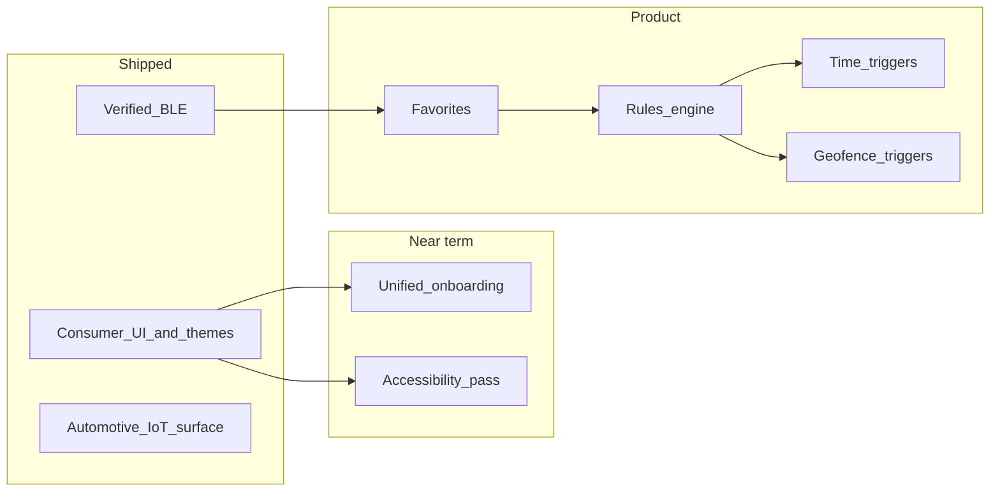

# Roadmap

Living plan for **Sound Kit Community**. Nothing here is a commitment or timeline; it records direction so contributors and users know what might come next. All work stays **local-first** (phone BLE only) unless an explicit decision says otherwise.

*Last refreshed: May 2026 — aligned with verified BLE, consumer UI, and current `main`.*

## Principles

- **Safety first** — No silent automation that could surprise a driver. Clear manual override and visible “why did the valve change?” affordances where automation exists.
- **State-gated writes** — Manual OPEN/CLOSE only sends the verified toggle when receiver state is known and differs from the target. Future automation must follow the same rule.
- **Privacy** — Geofencing and location-backed rules need **opt-in**, plain-language disclosure, and minimal retention. No selling or sharing location data (there is no backend today).
- **Accessibility** — Target **WCAG 2.1 AA** for contrast, semantics, touch targets (≥48dp), and screen reader labels as screens are touched.

## Done

| Area | What shipped |
|------|----------------|
| **BLE protocol** | APK-verified toggle (`0x01`), advertising signature scan, notification-driven valve state, state-gated OPEN/CLOSE, pairing flow. |
| **Physical receiver** | Real-car validation: connect, pair, open/close accepted by receiver. |
| **Consumer UI** | Calm Find / Control / More / Settings / Diagnostics; protocol hidden from primary journey. |
| **Themes** | Brand-inspired families with Light/Dark variants, gradients, local brand marks; default **Studio Blue** (navy + electric blue). |
| **Control polish** | Animated valve visual; disconnect / forget confirmation dialogs. |
| **Onboarding & legal** | Blocking first-run “use at your own risk” gate (DataStore + README disclaimer). |
| **Diagnostics export** | Copy, Save-to-file (SAF), file-only Share (no email subject/body autofill). |
| **Launcher** | Adaptive valve-glyph icon (foreground, background, monochrome). |
| **Android Auto / Automotive** | `SoundKitCarAppService` (IoT), `automotive_app_desc.xml`, `com.google.android.gms.car.application` meta-data, DHU testing documented in `DOCS.md`. |

## Near term

| Area | Intent |
|------|--------|
| **Permission onboarding** | Single first-run flow: risk acceptance (done) + Bluetooth permissions + notification / foreground-service explanation + battery optimization shortcut — today split across dialog and Settings. |
| **Theme polish** | Tune blue Studio default from device feedback; optional user-supplied brand SVGs to replace placeholder marks. |
| **Empty / error states** | Consistent recovery on every screen (retry scan, open settings, copy diagnostics). |
| **CI reliability** | Gradle wrapper JAR present so GitHub Actions runs `./gradlew` without bootstrap failures. |
| **Accessibility pass** | TalkBack order, focus order, contrast check on new blue default. |

## Later (product)

### Favorites and saved devices

- Pin or star receivers, **nicknames**, sort order.
- Optional **default device** and “connect on launch” (with clear disconnect and permission boundaries).

### Rules engine

- Persistent **rules**: when [triggers] then [actions] (e.g. open / close valve), with **precedence** and conflict resolution.
- Storage may evolve from DataStore to **Room** if rule complexity grows.

### Time-based automation

- **Schedules** — time windows, quiet hours vs “sport” hours, timezone-safe recurrence.
- **WorkManager** or **AlarmManager** with Doze / exact-alarm policy; execution tied to **connected BLE** and a user-visible last-run log.

### Geofencing automation

- **Geofence enter/exit** triggers (Android Geofencing API).
- Opt-in location (and possibly background location — high Play scrutiny); battery impact called out in UI.

### Notifications and Quick Settings

- Deep links to **pause all rules**, **last automation cause**, quick manual OPEN/CLOSE when connected.

## Non-goals (for now)

- **Cloud** accounts, remote control over the internet, or telemetry backends.
- **Official Akrapovič integration** or warranty support.
- **Projected Android Auto (Play distribution).** Policy categories (navigation, media, messaging, etc.) do not fit a valve controller. We ship the **IoT** Car App for **Android Automotive OS** and **DHU** sideload testing — see `DOCS.md` § Android Auto Testing.

## Dependency sketch

## Contributing

Open issues or PRs with a short **safety/privacy** note for any feature that moves metal (valve) or uses location in the background.
