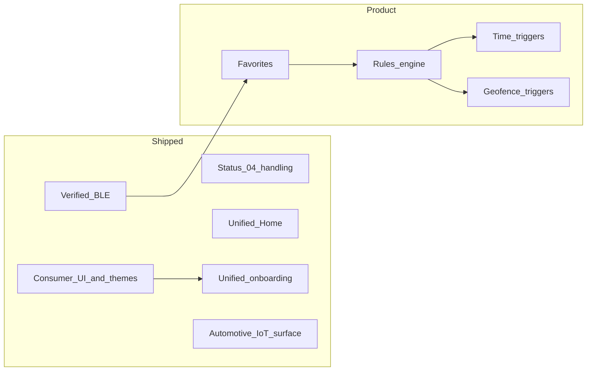

# Roadmap

Living plan for **Sound Kit Community**. Nothing here is a commitment or timeline; it records direction so contributors and users know what might come next. All work stays **local-first** (phone BLE only) unless an explicit decision says otherwise.

*Last refreshed: May 2026 — Beta automation (rules, schedules, geofences, notification controls) shipped.*

## Principles

- **Safety first** — No silent automation that could surprise a driver. Clear manual override and visible “why did the valve change?” affordances where automation exists.
- **State-gated writes** — Manual OPEN/CLOSE only sends the verified toggle when receiver state is known and differs from the target. Future automation must follow the same rule.
- **Privacy** — Geofencing and location-backed rules need **opt-in**, plain-language disclosure, and minimal retention. No selling or sharing location data (there is no backend today).
- **Accessibility** — Target **WCAG 2.1 AA** for contrast, semantics, touch targets (≥48dp), and screen reader labels as screens are touched.

## Done

| Area | What shipped |
|------|----------------|
| **BLE protocol** | APK-verified toggle (`0x01`), advertising signature scan, notification-driven valve state, state-gated OPEN/CLOSE, pairing flow. |
| **BLE stability (status `04`)** | Idle `0x04` stays connected with “receiver not ready” copy; no auto-reconnect storm; honest reconnect attempt counter. |
| **Physical receiver** | Real-car validation: connect, pair, open/close accepted by receiver. |
| **Unified Home** | Single primary tab: scan when disconnected, valve control when connected (no separate Find / Control tabs). |
| **Valve control card** | Combined valve visual + one Open/Close action button on the control surface. |
| **Consumer UI** | Calm Home / More / Settings / Diagnostics; protocol hidden from primary journey. |
| **Themes** | Brand-inspired families with Light/Dark variants, gradients, local brand marks; default **Studio Blue** (navy + electric blue). |
| **Onboarding & legal** | Unified first-run flow: risk, Bluetooth, notifications, battery (skippable); `onboardingCompletedAt` in DataStore. |
| **Empty / error states** | Shared `AkraStatePanel` on scan, control reconnect, diagnostics; retry connection from Home. |
| **Theme polish** | Stronger Studio/Audi light contrast; larger labeled color swatches on Appearance. |
| **CI reliability** | Committed `gradle-wrapper.jar`; GitHub Actions runs `./gradlew`. |
| **Accessibility pass** | Headings, content descriptions on onboarding and primary actions; smoke/instrumented coverage. |
| **Diagnostics export** | Copy, Save-to-file (SAF), file-only Share (no email subject/body autofill). |
| **Launcher** | Adaptive valve-glyph icon (foreground, background, monochrome). |
| **Android Auto / Automotive** | IoT Car App service, manifest descriptor, DHU testing. |
| **Projected AA (sideload)** | Car auto-reconnect, toggle + status-04 on template, Open on phone, notification/QS fallback docs. |
| **Confirmations** | Disconnect and Forget receiver confirmation dialogs. |
| **Favorites** | Up to 8 saved receivers, nicknames, default star, connect on launch; shared `RememberedDeviceConnector`. |
| **Smarter notifications** | `NotificationCopy` gating; nickname title; not-ready copy; valve actions disabled when unsafe. |
| **Quick Settings polish** | `QsTilePresenter`; not-ready inactive state; open app when disconnected. |
| **Rules engine (design)** | Domain models, `RuleEvaluator`, ADR/SPEC — no BLE execution or persistence yet. |
| **Rules execution (Beta)** | Persisted rules, `RuleExecutionEngine`, activity log, state-gated BLE writes. |
| **Time automation (Beta)** | Schedule triggers via WorkManager + evaluate on connect when ready. |
| **Geofencing (Beta)** | Up to 4 zones, opt-in location, enter/exit triggers via Geofencing API. |
| **Automation notifications (Beta)** | Pause/resume automation + last-run cause in foreground notification. |

## Near term

| Area | Intent |
|------|--------|
| **Maintenance** | Device feedback on themes, BLE edge cases, projected AA validation on more head units, Play policy as Android versions shift. |

## Later (product)

- **Automation polish** — richer schedule UI, map picker for zones, Room if rule/log volume grows, Quick Settings last-cause line.
- **Quiet hours / sport profiles** — grouped rules and timezone-safe recurrence beyond simple windows.

## Non-goals (for now)

- **Cloud** accounts, remote control over the internet, or telemetry backends.
- **Official Akrapovič integration** or warranty support.
- **Play Store listing in projected Android Auto.** Policy categories (navigation, media, messaging, etc.) do not fit a valve controller. **Sideload + developer mode** for projected AA and **IoT** for Automotive OS / DHU remain in scope — see `DOCS.md` § Android Auto Testing.

## Dependency sketch

## Contributing

Open issues or PRs with a short **safety/privacy** note for any feature that moves metal (valve) or uses location in the background.
