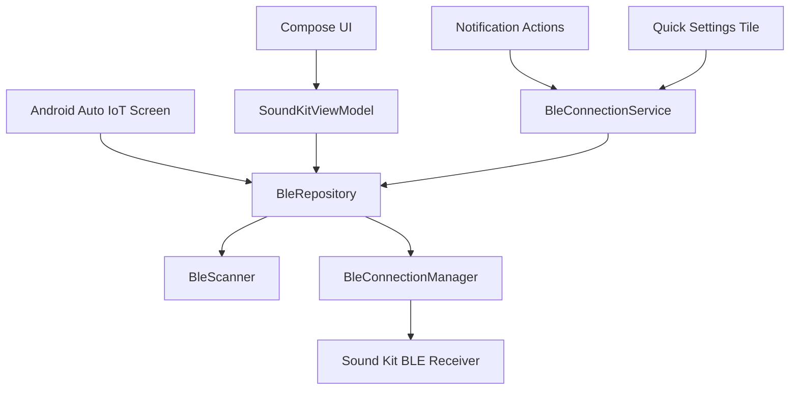

# Specification

## Goal

Provide a modern Android app that locally controls an Akrapovic Sound Kit BLE receiver using the protocol verified from the original Android APK.

## Package

`com.akrapovic.soundkit.community`

## Platform

- Minimum SDK: 26
- Target SDK: 35
- Android 12+ runtime Bluetooth permissions
- Android 8-11 location permission for BLE scanning compatibility

## Architecture

## BLE Behavior

- Scan accepts likely receivers by Sound Kit name hints and the original APK advertising signature (`FFFFFF` followed by ASCII `103`).
- Connect uses `connectGatt` with LE transport where available.
- If the receiver is not bonded, Android system pairing is started. The app does not hard-code a PIN.
- Service discovery logs every discovered service and characteristic and emits a copy-ready GATT profile block for troubleshooting.
- The original APK does not use a service UUID; the app finds characteristic `0000fff4-0000-1000-8000-00805f9b34fb` across all discovered services.
- Notifications are enabled on the same characteristic through CCCD `00002902-0000-1000-8000-00805f9b34fb`.
- Valve state is updated only from receiver status notifications:
  - `02` / `07`: closed
  - `03` / `06`: open
  - `04`: receiver error
- OPEN and CLOSE remain user-facing actions, but both are implemented safely over the verified toggle payload `01`:
  - Unknown state: no write.
  - Requested state already active: no-op success.
  - Requested state opposite current state: send one toggle write with `WRITE_TYPE_DEFAULT`.

## UI Behavior

- Scan screen is a guided setup flow with plain permission copy, one scan action, empty state, and receiver cards.
- Control screen focuses on current valve state and one safe next action. Protocol details are hidden from the primary journey. The valve state is rendered as an animated **valve visual** (two opposing arc plates that animate apart when Open and together when Closed; a soft accent glow pulses while Open). The visual is decorative; the helper text is the source of truth for screen readers.
- Diagnostics screen shows local logs and exposes a **file-only** export. Copy puts plain text on the clipboard; Save uses the system Storage Access Framework (`ACTION_CREATE_DOCUMENT`) to let the user pick a destination; Share builds an `ACTION_SEND` intent with **no `EXTRA_SUBJECT` and no `EXTRA_TEXT`** so email apps cannot auto-populate the user's account or message body.
- Settings screen controls auto-reconnect, detailed local logging, remembered receiver removal (with confirmation dialog), and background connection reliability.
- Disconnect and Forget receiver actions show a confirmation `AlertDialog` to prevent accidental in-car taps.
- A blocking first-run "Use at your own risk" dialog is shown until the user accepts; the acceptance timestamp is persisted in DataStore.
- Garage themes are persisted in DataStore and apply app-wide to the calmer premium companion UI. Themes are grouped into brand-inspired families, each with explicit Light and Dark variants, local brand mark drawables, and theme-driven gradients.

## Background Behavior

- A foreground service maintains the BLE connection and persistent notification.
- Notification actions call the same repository command path as the UI.
- Quick Settings tile opens the app when disconnected and toggles the last known valve state when connected.
- Android Auto exposes minimal low-distraction controls through the IoT category. The app targets Android **Automotive OS** (built-in head units) and the Desktop Head Unit simulator; it does **not** appear in **projected Android Auto** (phone-projected) because a valve-toggle controller does not fit any Google Play projected category. See `DOCS.md` § Android Auto Testing.

## Security

- No internet permission.
- No secrets.
- No cloud logging.
- No BLE writes to unknown characteristics or while valve state is unknown.
- No hard-coded pairing PIN.
- Minimal persisted data: saved receivers (JSON list, max 8), connect-on-launch flag, selected theme, and user settings.

## Saved receivers

- `SavedReceiver`: address, name, optional nickname, `isDefault`.
- CRUD via `SettingsStore`: save on connect (default if first), remove, set default, update nickname, forget all.
- **Connect on launch:** one attempt per process when onboarding complete, BLE granted, `connectOnLaunch` true, and `RememberedDeviceConnector.shouldAutoConnect`.

## Notification and Quick Settings

- Foreground notification combines connection, valve, and `receiverStatusMessage`; title uses default receiver display name when connected.
- Open/Close actions only when connected, valve state known, and not in not-ready status.
- Quick Settings tile: toggle when allowed; opens app when disconnected; inactive + `not ready` subtitle on status `04`.

## Drive mode

| Piece | Status |
|-------|--------|
| `PreferredValveMode`, `QuietStartSettings` | DataStore via `SettingsRepository`; quiet window start/end editable in Settings |
| `DriveModeEngine` | On first connect-ready per BLE session: quiet hold (default 3 min) → preferred mode; manual override per session |
| `ConnectReadyObserver` | `BleConnectionService` fires drive mode only on connect-ready false→true (not on valve state changes) |
| `RuleExecutionLog` | Ring buffer (~30 entries); reused for drive mode apply log |
| Reconnect | `RetryPolicy.maxAttempts = 8`; `BleRepository` stops GATT churn when gave up |

**UI:** Settings (full controls) + Home shortcut → Drive mode screen; notification pause/resume drive mode.

**Removed:** Beta rules UI, geofencing, WorkManager periodic evaluation, `play-services-location`.

## Future scope

Automation polish (map picker, profiles, Room) in `ROADMAP.md` Later.

## Testing

- JVM unit tests cover protocol guardrails, permission policy, retry policy, repository state transitions, and ViewModel state reduction.
- Android instrumented smoke tests cover key Compose screens, notification construction, diagnostics sharing, no-internet manifest behavior, FileProvider declaration, and Android Auto IoT declaration.
- Physical receiver smoke testing is documented in `TESTING.md` and must pass before public release of valve control.

