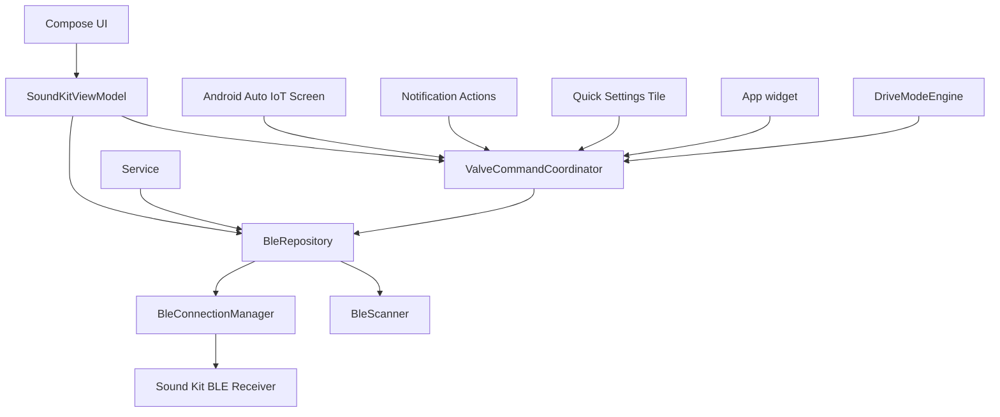
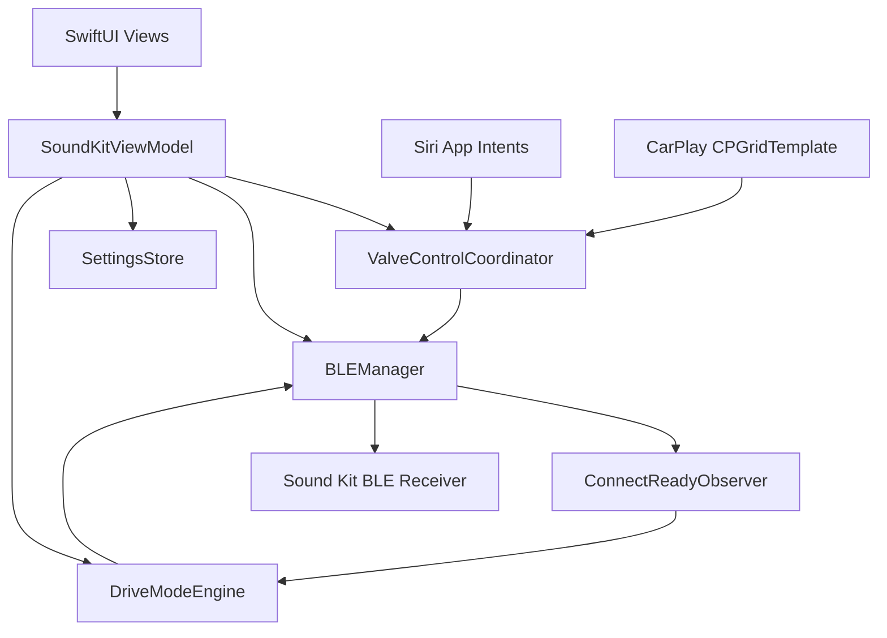

# Specification

## Goal

Provide a modern Android app that locally controls an Akrapovic Sound Kit BLE receiver using the protocol verified from the original Android APK.

## Package

`com.akrapovic.soundkit.community`

## Platform

- Minimum SDK: 26
- Target SDK: 35
- Android 12+ runtime Bluetooth permissions
- Android 8-11 location permission for BLE scanning compatibility
- Android release artifacts are signed only when `ANDROID_RELEASE_STORE_FILE`,
  `ANDROID_RELEASE_STORE_PASSWORD`, `ANDROID_RELEASE_KEY_ALIAS`, and
  `ANDROID_RELEASE_KEY_PASSWORD` are supplied by the build environment.
- Android and iOS marketing version: 0.3.0 (build/version code: 3).

## Architecture

## Release and privacy boundaries

- Release Android Car App sessions validate the official Android Auto and
  Automotive host package signing certificates from
  `soundkit_car_app_hosts_allowlist`; debuggable builds alone allow all hosts
  for DHU development.
- Android excludes `files/crashes/` and `files/diagnostics/` from cloud backup
  and device transfer. User-created diagnostics exports use
  `cache/diagnostics/`, which Android does not back up.
- iOS ships `PrivacyInfo.xcprivacy`: no tracking, no collected data, and
  `UserDefaults` access declared for local app settings (`CA92.1`).
- iOS normal builds set `CARPLAY_ENABLED=NO` and have no CarPlay scene or
  driving-task entitlement. CarPlay is an explicit post-approval release
  configuration, never an inferred capability.

## BLE Behavior

- Scan accepts likely receivers by Sound Kit name hints and the original APK advertising signature (`FFFFFF` followed by ASCII `103`).
- Connect uses `connectGatt` with LE transport where available.
- If the receiver is not bonded, Android system pairing is started. The app does not hard-code a PIN.
- Service discovery logs every discovered service and characteristic and emits a copy-ready GATT profile block for troubleshooting.
- The original APK does not use a service UUID; the app finds characteristic `0000fff4-0000-1000-8000-00805f9b34fb` across all discovered services.
- Notifications are enabled on the same characteristic through CCCD `00002902-0000-1000-8000-00805f9b34fb`.
- Valve state is updated only from receiver status notifications:
  - `02` / `07`: closed
  - `03` / `06`: open
  - `04`: receiver error
- OPEN and CLOSE remain user-facing actions, but both are implemented safely over the verified toggle payload `01`:
  - Unknown state: no write.
  - Requested state already active: no-op success.
  - Requested state opposite current state: send one toggle write with `WRITE_TYPE_DEFAULT`.
  - A write response starts a five-second confirmation window; only a matching target-state notification succeeds. Opposite, unknown, `04`, timeout, and disconnect outcomes fail closed.
- iOS reports a receiver connected only after characteristic discovery and notification subscription succeed; it uses `bluetooth-central` background restoration without sending a command during restoration.

## UI Behavior

- Scan screen is a guided setup flow with plain permission copy, one scan action, empty state, and receiver cards.
- Control screen focuses on current valve state and one safe next action. Protocol details are hidden from the primary journey. The valve visual communicates open/closed/unknown states, animates only while unknown or busy, and stays static with reduced motion. The visual is decorative; the helper text is the source of truth for screen readers.
- Home preserves connection progress rather than returning to scan: connecting shows a “Preparing receiver” banner, reconnecting and errors expose a distinct retry action, and a connected receiver with unknown valve state shows “Waiting for status” with controls safely disabled. Active scans stop after 15 seconds and show a “No receiver found” retry state when empty.
- Valve state, connection changes, and recoverable errors use polite accessibility announcements. Success and failure haptics are limited to completed valve command outcomes; decorative valve artwork is excluded from screen-reader navigation and all motion honors the system reduced-motion preference.
- Diagnostics screen shows local logs and exposes a **file-only** export. Copy puts plain text on the clipboard; Save uses the system Storage Access Framework (`ACTION_CREATE_DOCUMENT`) to let the user pick a destination; Share builds an `ACTION_SEND` intent with **no `EXTRA_SUBJECT` and no `EXTRA_TEXT`** so email apps cannot auto-populate the user's account or message body.
- Settings screen controls auto-reconnect, detailed local logging, remembered receiver removal (with confirmation dialog), and background connection reliability.
- Disconnect and Forget receiver actions show a confirmation `AlertDialog` to prevent accidental in-car taps.
- A blocking first-run "Use at your own risk" dialog is shown until the user accepts; the acceptance timestamp is persisted in DataStore.
- Garage themes are persisted in DataStore and apply app-wide to the calmer premium companion UI. Themes are grouped into brand-inspired families, each with explicit Light and Dark variants, local brand mark drawables, and theme-driven gradients.

## Background Behavior

- A foreground service maintains the BLE connection and persistent notification.
- UI, notification, Quick Settings, widget, drive mode, and Android Auto commands use the process-wide `ValveCommandCoordinator`. It serializes requests, returns no-op success for a matching known state, and rejects disconnected, unknown, and not-ready state before a repository call.
- Android Open/Close/Status launcher-shortcut fulfillment is internal-only: `AssistantActionActivity` accepts a fixed action only, and `VoiceValveActionRouter` resolves the saved default receiver without accepting a BLE address. It reconnects only that receiver within 8 seconds and sends Open/Close through `ValveCommandCoordinator`; status reports only a known receiver notification state. Google Assistant custom App Actions are deliberately not advertised because no reliable IoT fulfillment contract is declared.
- GATT discovery and notification subscription establish readiness; write acknowledgement is transport-only and a target-state notification confirms a command result.
- Quick Settings tile opens the app when disconnected and toggles the last known valve state when connected.
- Android Auto exposes minimal low-distraction controls through the IoT category. It is testable on DHU, compatible Automotive OS targets, and sideloaded projected debug paths with Android Auto developer settings. Google Play projected distribution remains out of scope because valve control does not fit a published category. See `DOCS.md` § Android Auto Testing.

## Security

- No internet permission.
- No secrets.
- No cloud logging.
- No BLE writes to unknown characteristics or while valve state is unknown.
- No hard-coded pairing PIN.
- Minimal persisted data: saved receivers (JSON list, max 8), independent phone-launch and car-entry connection flags, selected theme, and user settings.

## Saved receivers

- `SavedReceiver`: address, name, optional nickname, `isDefault`.
- CRUD via `SettingsStore`: save on connect (default if first), remove, set default, update nickname, forget all.
- **Connect on launch:** one attempt per process when onboarding complete, BLE granted, `connectOnLaunch` true, and `ConnectionPriorityPolicy.shouldAutoConnectOnLaunch` (respects head-unit priority — secondary phones defer until Car App session is active on that device).
- **Connect in car:** a separate default-on `connectInCar` preference controls automatic connection when a Car App session opens; it does not alter phone launch behavior.
- **Car surface:** an IoT `GridTemplate` shows separate Open and Close items only for a connected, ready receiver with known state. The matching current-state item is inert, both are inert during a command, and controls are hidden while state is unknown or the receiver is not ready. Missing onboarding, Bluetooth permissions, or a default receiver show a phone-only setup message.
- **Head unit priority** (default on): when enabled, only the phone with an active Android Auto session auto-connects on launch; other phones yield on BLE contention and show **Take control** on Home.

## Multi-phone / same car

- One BLE receiver accepts one GATT connection at a time.
- Each phone has independent settings; no accounts or sync.
- **Primary** (Android Auto active on this phone): auto-connect + auto-reconnect per existing policy.
- **Secondary** (no Car App session): no launch auto-connect; contention → yield; manual **Take control** sets `userRequestedControl` until disconnect.
- `headUnitPriorityEnabled = false` restores prior race behavior for power users.

## Notification and Quick Settings

- Foreground notification combines connection, valve, and `receiverStatusMessage`; title uses default receiver display name when connected.
- Open/Close actions only when connected, valve state known, and not in not-ready status.
- Quick Settings tile: toggle when allowed; opens app when disconnected; inactive + `not ready` subtitle on status `04`.

## Drive mode

| Piece | Status |
|-------|--------|
| `PreferredValveMode`, `QuietStartSettings` | DataStore via `SettingsRepository`; quiet window start/end editable in Settings |
| `DriveModeEngine` | On first connect-ready per BLE session: quiet hold (default 3 min) → preferred mode; manual override per session |
| `ConnectReadyObserver` | `BleConnectionService` fires drive mode only on connect-ready false→true (not on valve state changes) |
| `RuleExecutionLog` | Ring buffer (~30 entries); reused for drive mode apply log |
| Reconnect | `RetryPolicy.maxAttempts = 8`; `BleRepository` stops GATT churn when gave up |

**UI:** Settings (full controls) + Home shortcut → Drive mode screen; notification pause/resume drive mode.

**Removed:** Beta rules UI, geofencing, WorkManager periodic evaluation, `play-services-location`.

## Future scope

Field validation and external-platform gates are tracked in `ROADMAP.md`. The
retired rules, schedule, WorkManager, and geofencing automation system is not
future scope; drive mode is the supported local automation model.

## Testing

- JVM unit tests cover protocol guardrails, command de-duplication, widget/Quick Settings and notification gating, settings-backup validation, in-car connection policy, car-screen state reduction, and theme text contrast.
- Android instrumented smoke tests cover key Compose screens and accessibility semantics, notification construction, diagnostics sharing, no-internet manifest behavior, FileProvider declaration, and Android Auto IoT declaration.
- Android CI explicitly runs JVM tests, Paparazzi verification, phone debug assembly, and Wear debug assembly. iOS CI uses the pinned iPhone 16 / iOS 18.6 simulator for build and unit tests when iOS or shared protocol-contract files change.
- Physical receiver smoke testing is documented in `TESTING.md` and must pass before public release of valve control.

## iOS companion (dev v1)

Bundle ID: `com.akrapovic.soundkit.community` (matches Android base ID).

### Platform

- Minimum deployment: **iOS 17.0**
- Swift 5.9+, Xcode 15+
- CoreBluetooth only — **no internet**, no accounts, no cloud logging
- CoreBluetooth `bluetooth-central` background mode and central-manager state restoration support safe connection recovery; no blind background valve write is permitted.

### Architecture

### BLE behavior

Mirrors Android (see `BLE_PROTOCOL.md`):

- Scan filters likely receivers by name hints and advertising signature (`FFFFFF` + ASCII `103`).
- Connect via `CBCentralManager`; system pairing UI when the receiver requires a PIN.
- Discover characteristic `0000fff4-0000-1000-8000-00805f9b34fb` across all services.
- Enable notifications via CCCD `00002902-0000-1000-8000-00805f9b34fb`.
- Valve state from notifications only: `02`/`07` closed, `03`/`06` open, `04` not ready.
- Toggle payload `01` with the same state-gated rules as Android `SoundKitProtocol.commandPayload`.
- Status `04`: remain connected, show not-ready copy, disable valve controls (no reconnect storm).
- Connection progress, reconnect failures, and retry remain on the Home control journey instead of falling back to Scan prematurely. Unknown status shows “Waiting for status”; disconnect requires confirmation. Valve commands provide in-flight, success, and failure feedback with system haptics, VoiceOver announcements, Dynamic Type-safe layouts, and reduced-motion valve visuals.
- Auto-reconnect capped at **8** attempts with user-visible retry.

### UI behavior

- Tab shell: **Home** (scan or connected valve hero), **More** (Settings, Appearance, Advanced → Diagnostics).
- Onboarding: risk disclaimer, vehicle picker, Bluetooth permission. Steps unlock in order; completed sections collapse to a short summary (Review / Change car). After a model is chosen the make list hides so the next permission step stays on screen.
- Drive mode screen: preferred Open/Closed, quiet neighbours window, quick profiles (Everyday / Quiet street / Track).
- Garage themes: Studio + Audi RS Dark (default when Audi RS3 selected in onboarding).
- Diagnostics: local ring-buffer log, share `.txt` export, mailto support@appsforgood.net.
- Settings: receiver rename/default/confirmed forget, an eight-device cap, independent default-on `connectInCar`, and opt-in detailed local BLE logging.
- Status `04`: Home keeps the connection, disables control, and presents a parked-use readiness checklist rather than retrying blindly.
- Scan cards pair raw RSSI with a friendly signal-strength hint; connection, retry, preparation, and failure states remain explicit on Home.
- Siri: Open, Close, and status intents use the single `ValveControlCoordinator`. Open/Close speak success only after a notification confirms the requested state.
- CarPlay: entitlement-gated, shallow Open/Close/status `CPGridTemplate`; all setup, permissions, diagnostics, and receiver selection remain phone-only. The scene is unavailable until Apple approves `com.apple.developer.carplay-driving-task` and provisioning includes it.

### Persistence

`SettingsStore` (UserDefaults + JSON Codable): onboarding timestamps, selected vehicle, garage theme, up to 8 saved receivers, independent connect-on-launch/connect-in-CarPlay preferences, auto-reconnect, drive mode, quiet-start, and detailed local logging. Versioned exports are validated and atomically imported; Android v1 preferences map to iOS fields, but foreign BLE identifiers are discarded and require a re-scan.

### Distribution

Developer install via Xcode or ad-hoc IPA only. TestFlight and App Store are deferred until RS3 hardware smoke passes. See `ios/SoundKitCommunity/README.md`.

### Testing

- XCTest unit tests for protocol, quiet window, connect-ready observer, drive mode profiles, Siri dialog/result mapping, settings validation/receiver CRUD, in-car connection policy, and backup import rejection.
- CI: macOS runner build + simulator unit tests (no BLE hardware).
- Physical smoke: `TESTING.md` § iOS device smoke (required before owner distribution).

