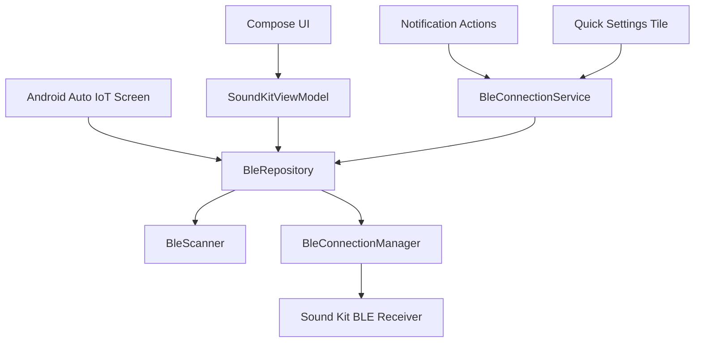

# Specification

## Goal

Provide a modern Android app that locally controls an Akrapovic Sound Kit BLE receiver after the receiver protocol is verified.

## Package

`com.akrapovic.soundkit.community`

## Platform

- Minimum SDK: 26
- Target SDK: 35
- Android 12+ runtime Bluetooth permissions
- Android 8-11 location permission for BLE scanning compatibility

## Architecture

## BLE Behavior

- Scan uses service UUID filtering after verification.
- Until verification, scan results include likely receivers by advertised or connected name hints.
- Connect uses `connectGatt` with LE transport where available.
- Service discovery logs every discovered service and characteristic.
- Valve writes require verified protocol fields:
  - service UUID
  - command characteristic UUID
  - write type
  - command payload
- Missing protocol data produces a non-recoverable user-visible error and no BLE write.

## UI Behavior

- Scan screen handles permission rationale, scanning, empty state, and device list.
- Control screen displays connection status, receiver identity, valve state, and large OPEN/CLOSE buttons.
- Diagnostics screen shows local BLE logs and can copy an export report.
- Settings screen controls auto-reconnect, debug logging, remembered receiver removal, and battery optimization guidance.

## Background Behavior

- A foreground service maintains the BLE connection and persistent notification.
- Notification actions call the same repository command path as the UI.
- Quick Settings tile opens the app when disconnected and toggles the last known valve state when connected.
- Android Auto exposes minimal low-distraction controls through the IoT category.

## Security

- No internet permission.
- No secrets.
- No cloud logging.
- No BLE writes to unverified characteristics.
- Minimal persisted data: receiver name/address and user settings.

## Future scope

Planned features (favorites, rules, schedules, geofencing, broader UI polish) are described in `ROADMAP.md` and do not change the current security model unless explicitly revised.

## Testing

- JVM unit tests cover protocol guardrails, permission policy, retry policy, repository state transitions, and ViewModel state reduction.
- Android instrumented smoke tests cover key Compose screens, notification construction, no-internet manifest behavior, and Android Auto IoT declaration.
- Physical receiver smoke testing is documented in `TESTING.md` and must pass before enabling verified valve commands.

