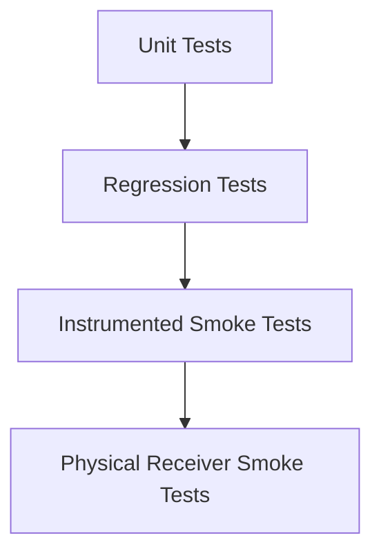

# Testing

This project uses layered testing so most safety and regression coverage can run without a vehicle or BLE receiver.

## Test Layers



## Unit Tests

Run:

```bash
./gradlew :app:testDebugUnitTest
```

Covered areas:

- BLE protocol fail-closed behavior
- Android version permission policy
- Exponential reconnect backoff
- Repository scan/connect/disconnect/reconnect behavior with fake BLE gateways
- ViewModel state reduction and command error surfacing

These tests do not need Android BLE hardware.

## Instrumented Smoke Tests

Run on an emulator or physical Android test phone:

```bash
./gradlew :app:connectedDebugAndroidTest
```

Covered areas:

- Scan screen permission rationale
- Scan screen empty state
- Control screen disables OPEN/CLOSE while the protocol is unverified
- Diagnostics screen renders local export controls
- Settings screen renders safety and battery optimization controls
- Persistent notification can be built
- Manifest does not request `INTERNET`
- Android Auto service declares the local-only IoT category

## CI

GitHub Actions runs:

- `:app:testDebugUnitTest`
- `:app:assembleDebug`
- `:app:connectedDebugAndroidTest` on an Android 35 emulator

CI uploads:

- unit test reports
- instrumented test reports
- debug APK artifact

## Physical Receiver Smoke Checklist

Only run this checklist after `BLE_PROTOCOL.md` contains verified UUIDs, command bytes, and write type from the original APK or an HCI capture.

Safety requirements:

- Vehicle parked.
- Safe ventilation.
- No testing on public roads.
- One command at a time.
- Diagnostics enabled.

Steps:

1. Install the debug APK.
2. Grant Bluetooth permissions.
3. Confirm the app has no internet permission in Android app info.
4. Power on the Sound Kit receiver.
5. Scan and verify the receiver appears with the expected name or service UUID.
6. Connect to the receiver.
7. Confirm service discovery logs match `BLE_PROTOCOL.md`.
8. Send CLOSE once.
9. Confirm the valve physically closes.
10. Send OPEN once.
11. Confirm the valve physically opens.
12. Lock the phone screen for at least two minutes.
13. Confirm the foreground service keeps the connection alive.
14. Test notification CLOSE and OPEN actions.
15. Test the Quick Settings tile.
16. Test Android Auto developer surface if available.
17. Export diagnostics and save it with the APK version, phone model, Android version, and receiver observations.

Stop testing if:

- Discovered services do not match `BLE_PROTOCOL.md`.
- The command characteristic is missing.
- Command behavior differs from the original app.
- The receiver repeatedly disconnects or reports write errors.
- Any physical valve movement is unexpected.

## Release Gate

Before a public release that enables real valve commands:

- Unit tests pass.
- Instrumented smoke tests pass.
- `BLE_PROTOCOL.md` has evidence for every command byte.
- Physical receiver smoke checklist passes.
- No internet permission is present.
- Diagnostics export from the hardware test is reviewed.

