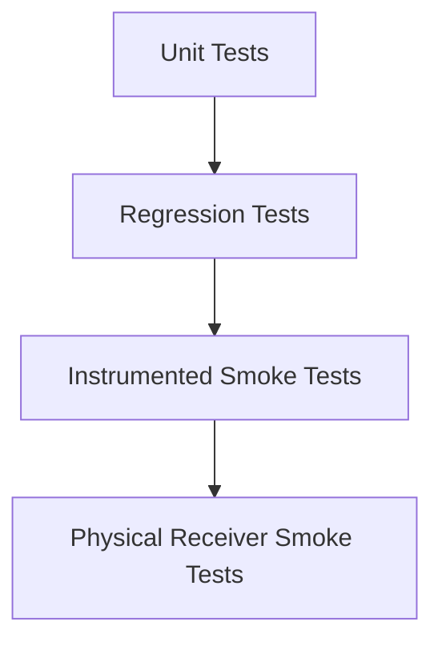

# Testing

This project uses layered testing so most safety and regression coverage can run without a vehicle or BLE receiver.

## Test Layers



## Unit Tests

Run:

```bash
./gradlew :app:testDebugUnitTest
```

`assembleDebug` also depends on `testDebugUnitTest`, so a local APK build fails fast if JVM tests fail:

```bash
./gradlew :app:assembleDebug
```

Covered areas:

- Verified APK protocol constants, advertising signature parsing, toggle payload gating, and status-byte parsing
- Android version permission policy
- Exponential reconnect backoff
- Repository scan/connect/disconnect/reconnect behavior with fake BLE gateways
- ViewModel state reduction and command error surfacing
- Diagnostics report generation and local crash-log round trip

These tests do not need Android BLE hardware.

## Instrumented Smoke Tests

Run on an emulator or physical Android test phone:

```bash
./gradlew :app:connectedDebugAndroidTest
```

Compose smoke tests currently run on API 35 and below. On Android 16 devices, AndroidX Espresso can fail before app assertions with `InputManager.getInstance`; CI uses an Android 35 emulator for Compose coverage while newer local devices still run manifest/service smoke checks.

Covered areas:

- Scan screen permission rationale
- Scan screen empty state
- Control screen waits for receiver status before enabling valve commands
- Diagnostics screen renders Copy/Share export controls and duplicate-timestamp entries do not crash
- Settings screen renders reconnect, local logging, and background connection controls
- Garage themes apply app-wide and persist through DataStore-backed settings
- Persistent notification can be built
- Manifest does not request `INTERNET`
- Manifest declares a non-exported diagnostics `FileProvider`
- Android Auto service declares the local-only IoT category

## CI

GitHub Actions runs a gated pipeline:

- `:app:testDebugUnitTest`
- `:app:connectedDebugAndroidTest` on an Android 35 emulator
- `:app:assembleDebug`

CI uploads:

- unit test reports
- instrumented test reports
- debug APK artifact

## Physical Receiver Smoke Checklist

The original APK protocol is now statically verified, but physical receiver testing is still required before a public release because the APK exposes a toggle command rather than separate open and close commands.

### Discovery And Pairing Pass

1. Install the debug APK.
2. Grant Bluetooth permissions.
3. Confirm the app has no internet permission in Android app info.
4. Power on the Sound Kit receiver.
5. Scan and verify the receiver appears as `SoundKit` or through the verified advertising signature.
6. Connect to the receiver and complete Android system pairing with the receiver/manual PIN if prompted.
7. Open `More -> Diagnostics`.
8. Tap `Share report` and email the generated `.txt` diagnostics attachment to yourself.
9. Save the report with the vehicle state and confirm it includes app version, phone model, Android version, receiver address, and GATT profile.
10. Confirm the `GATT PROFILE START` / `GATT PROFILE END` block contains characteristic `0000fff4-0000-1000-8000-00805f9b34fb` and CCCD `00002902-0000-1000-8000-00805f9b34fb`.
11. Confirm the Control screen leaves commands disabled until the first receiver status notification is received.

Stop discovery if the receiver repeatedly disconnects, Android shows pairing errors, or the diagnostics report does not include a GATT profile block.

If the app crashes, reopen it and go to `More -> Diagnostics`. A crash panel appears with `Copy crash`, `Share crash`, and `Dismiss crash log`. Crash logs remain local until the user explicitly shares them.

### Command Smoke Pass

Only run this checklist after discovery, pairing, service discovery, and receiver status notifications match `BLE_PROTOCOL.md`.

Safety requirements:

- Vehicle parked.
- Safe ventilation.
- No testing on public roads.
- One command at a time.
- Diagnostics enabled.

Steps:

1. Install the debug APK.
2. Grant Bluetooth permissions.
3. Confirm the app has no internet permission in Android app info.
4. Power on the Sound Kit receiver.
5. Scan and verify the receiver appears as `SoundKit` or through the verified advertising signature.
6. Connect to the receiver.
7. Confirm service discovery logs match `BLE_PROTOCOL.md`.
8. Wait until the app shows `Valves open` or `Valves closed`.
9. If the app shows `Valves open`, tap `Close valves` once and confirm the valve physically closes.
10. If the app shows `Valves closed`, tap `Open valves` once and confirm the valve physically opens.
11. Confirm the app does not send a command when the requested state already matches the receiver state.
12. Lock the phone screen for at least two minutes.
13. Confirm the foreground service keeps the connection alive.
14. Test notification CLOSE and OPEN actions.
15. Test the Quick Settings tile.
16. Test Android Auto developer surface if available.
17. Export diagnostics and save it with the APK version, phone model, Android version, and receiver observations.

Stop testing if:

- Discovered services do not match `BLE_PROTOCOL.md`.
- The command characteristic is missing.
- The app never receives a known status byte (`02`, `03`, `06`, or `07`).
- Command behavior differs from the original app.
- The receiver repeatedly disconnects or reports write errors.
- Any physical valve movement is unexpected.

## Release Gate

Before a public release that enables real valve commands:

- Unit tests pass.
- Instrumented smoke tests pass.
- `BLE_PROTOCOL.md` has APK evidence for the toggle command and physical evidence for the receiver GATT profile.
- Physical receiver smoke checklist passes.
- No internet permission is present.
- Diagnostics export from the hardware test is reviewed.

