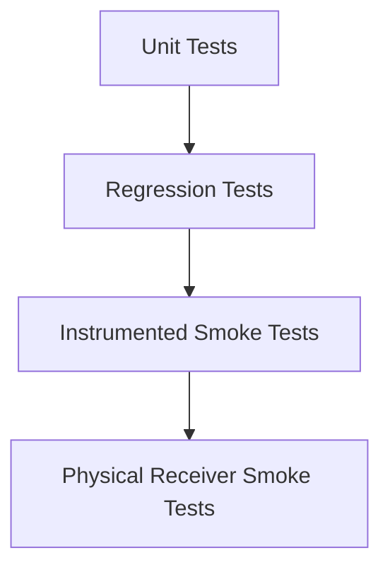

# Testing

This project uses layered testing so most safety and regression coverage can run without a vehicle or BLE receiver.

## Test Layers



## Unit Tests

Run:

```bash
./gradlew :app:testDebugUnitTest
```

`assembleDebug` also depends on `testDebugUnitTest`, so a local APK build fails fast if JVM tests fail:

```bash
./gradlew :app:assembleDebug
```

Covered areas:

- Verified APK protocol constants, advertising signature parsing, toggle payload gating, and status-byte parsing
- Android version permission policy
- Exponential reconnect backoff
- Repository scan/connect/disconnect/reconnect behavior with fake BLE gateways
- ViewModel state reduction and command error surfacing
- Saved receivers codec (JSON, migration, default uniqueness cap)
- `RememberedDeviceConnector` connect-on-launch policy (phone and car)
- `NotificationCopy` and `QsTilePresenter` action gating
- `DriveModeEngine` — preferred valve on connect + quiet start; manual toggle wins per session
- Reconnect backoff **max 8 attempts**
- Diagnostics report generation and local crash-log round trip
- **Paparazzi** — README screenshot composables (Audi RS Dark, drive mode, quiet neighbours)

These tests do not need Android BLE hardware.

## Instrumented Smoke Tests

Run on an emulator or physical Android test phone (local/optional — **not** run in GitHub Actions; API 35 emulators often fail to boot on hosted runners):

```bash
./gradlew :app:connectedDebugAndroidTest
```

Compose smoke tests run on API 35 and below. On Android 16 devices, AndroidX Espresso can fail before app assertions with `InputManager.getInstance`; use Paparazzi for Compose UI captures on CI and bleeding-edge phones.

Covered areas:

- Scan screen permission rationale
- Scan screen empty state
- Control screen waits for receiver status before enabling valve commands
- Diagnostics screen renders Copy/Share export controls and duplicate-timestamp entries do not crash
- Settings screen: connect on launch, saved receiver list, drive mode controls
- Notification: disconnected omits valve actions; connected enables Open/Disconnect
- Garage themes apply app-wide and persist through DataStore-backed settings
- Persistent notification can be built
- Manifest does not request `INTERNET`
- Manifest declares a non-exported diagnostics `FileProvider`
- Android Auto service declares the local-only IoT category

## Projected Android Auto Validation (sideload)

Use this checklist for **projected Android Auto** (phone USB or wireless to a standard head unit). This is separate from **Google Play** distribution, which remains a non-goal for valve-control apps.

Record results in your test notes as **Pass / Fail / Not tested**.

| Step | Action | Pass criteria |
|------|--------|---------------|
| 1 | Install debug APK; complete first-run onboarding; connect to receiver once on phone | Remembered receiver stored |
| 2 | Settings → Connected devices → Connection preferences → **Android Auto** (Pixel) or search Settings; tap **Version** 10× → **Developer mode** | Developer menu visible |
| 3 | Enable **Unknown sources** (and **Start head unit server** for DHU) | Settings stick after restart |
| 4 | **DHU (Mac):** run Desktop Head Unit; launch **Sound Kit** from launcher | Pane shows receiver + valve rows |
| 5 | **Real car:** plug in or wireless AA; open AA launcher → find **Sound Kit** | App listed (sideload + dev mode) |
| 6 | Open Sound Kit on head unit while **parked** | Template loads without crash |
| 7 | With remembered receiver: confirm auto-reconnect or **Connecting…** row | No need to open phone app first |
| 8 | When connected + status known: tap **Open valves** / **Close valves** (toggle label) | Receiver accepts command |
| 9 | If receiver sends status `04`: car shows **Not ready**; toggle hidden | Matches phone behavior |
| 10 | If app never appears in AA launcher: use **fallback controls** (below) | Notification + Quick Settings still work |

### Fallback when Sound Kit is not in the AA launcher

If step 5 fails, you can still control valves while parked without the car template:

1. Connect on the phone (Home tab) before or after plugging into the car.
2. Use the **foreground notification** actions: Open, Close, Disconnect.
3. Add the **Sound Kit** Quick Settings tile (Edit tiles) for one-tap toggle while connected.

Document whether the launcher failure is on your head unit model and Android Auto version.

## CI

GitHub Actions runs a gated pipeline:

- `:app:assembleDebug` (runs `:app:testDebugUnitTest` first — JVM tests + Paparazzi screenshot verify)

Instrumented smoke tests (`connectedDebugAndroidTest`) are **local only** — the Android 35 emulator often times out on GitHub-hosted runners.

CI uploads:

- unit test reports
- debug APK artifact

- debug APK artifact

## iOS unit tests

Run on the Simulator (no BLE hardware required):

```bash
cd ios
xcodebuild -project SoundKitCommunity.xcodeproj -scheme SoundKitCommunity \
  -destination 'platform=iOS Simulator,name=iPhone 16' \
  CODE_SIGNING_ALLOWED=NO test
```

Covered areas:

- `SoundKitProtocol` — status parsing, state-gated toggle payload
- `QuietWindowEvaluator` — overnight windows and active detection
- `ConnectReadyObserver` — connect-ready transition on first known valve
- `DriveModeProfile` — Quiet street preset enables quiet start

GitHub Actions **Build iOS** workflow (`.github/workflows/ios-build.yml`) runs the same build + test path on `macos-latest` when `ios/**` changes.

## iOS device smoke

Physical receiver testing on iPhone is required before any owner-facing iOS distribution. The Simulator cannot exercise CoreBluetooth.

**Prerequisites:** parked vehicle, Sound Kit receiver powered, iPhone with app installed via Xcode (see `ios/SoundKitCommunity/README.md`).

Record each step as **Pass / Fail / Not tested** and note iOS version, iPhone model, and app build.

### Discovery and pairing

| # | Step | Pass criteria | Result |
|---|------|---------------|--------|
| 1 | Install dev build from Xcode on physical iPhone | App launches | Not tested |
| 2 | Complete onboarding (risk, vehicle, Bluetooth) | Main tabs visible | Not tested |
| 3 | Confirm app has no network entitlement in Settings | No cellular/data usage for app | Not tested |
| 4 | Power on Sound Kit receiver | Receiver advertising | Not tested |
| 5 | Home → Scan | Receiver appears (`SoundKit` or signature `103`) | Not tested |
| 6 | Tap receiver → connect | System PIN UI if required; connects | Not tested |
| 7 | Wait for status notification | Home shows Open or Closed (not Unknown) | Not tested |
| 8 | More → Advanced → Diagnostics → Share | `.txt` export includes device + BLE events | Not tested |

### Valve commands (parked only)

| # | Step | Pass criteria | Result |
|---|------|---------------|--------|
| 9 | Tap Close when Open | Valve closes; UI updates | Not tested |
| 10 | Tap Open when Closed | Valve opens; UI updates | Not tested |
| 11 | Tap same state again | No duplicate write (no error) | Not tested |
| 12 | If status `04` reproducible | Stays connected; buttons disabled; no reconnect storm | Not tested |

### Settings and drive mode

| # | Step | Pass criteria | Result |
|---|------|---------------|--------|
| 13 | Connect-on-launch: kill app → relaunch | Auto-connects to saved default receiver | Not tested |
| 14 | Drive mode → preferred **Open** → reconnect | Valves open when connect-ready | Not tested |
| 15 | Quiet neighbours: 22:00–07:00, 5 min hold → connect in window | Closed on connect; opens after hold unless manual override | Not tested |
| 16 | Reconnect cap: power off receiver | Stops after ~8 attempts; tap to retry works | Not tested |

### iOS CI

GitHub Actions runs **build + simulator unit tests** only (`.github/workflows/ios-build.yml`). No BLE integration on CI.

## Physical Receiver Smoke Checklist

The original APK protocol is now statically verified, but physical receiver testing is still required before a public release because the APK exposes a toggle command rather than separate open and close commands.

### Discovery And Pairing Pass

1. Install the debug APK.
2. Grant Bluetooth permissions.
3. Confirm the app has no internet permission in Android app info.
4. Power on the Sound Kit receiver.
5. Scan and verify the receiver appears as `SoundKit` or through the verified advertising signature.
6. Connect to the receiver and complete Android system pairing with the receiver/manual PIN if prompted.
7. Open `More -> Diagnostics`.
8. Tap `Share report` and email the generated `.txt` diagnostics attachment to yourself.
9. Save the report with the vehicle state and confirm it includes app version, phone model, Android version, receiver address, and GATT profile.
10. Confirm the `GATT PROFILE START` / `GATT PROFILE END` block contains characteristic `0000fff4-0000-1000-8000-00805f9b34fb` and CCCD `00002902-0000-1000-8000-00805f9b34fb`.
11. Confirm the Control screen leaves commands disabled until the first receiver status notification is received.

Stop discovery if the receiver repeatedly disconnects, Android shows pairing errors, or the diagnostics report does not include a GATT profile block.

If the app crashes, reopen it and go to `More -> Diagnostics`. A crash panel appears with `Copy crash`, `Share crash`, and `Dismiss crash log`. Crash logs remain local until the user explicitly shares them.

### Favorites and connect on launch

1. Clear app data → connect once → force-stop → relaunch with **Connect on launch** enabled in Settings.
2. Confirm the app attempts to connect without scanning (default saved receiver).
3. Save a second receiver (connect from scan) → set the other as default → relaunch → confirm connect targets the new default.
4. With receiver connected and status known: notification Open/Close work while parked; Quick Settings tile toggles.
5. With status `04`: notification and tile omit valve actions; copy shows not-ready.
6. **Drive mode:** Settings → set preferred **Open** → connect → valves open when ready.
7. **Quiet neighbours:** Settings → Drive mode → enable quiet neighbours → set **Start** / **End** + 3 min hold → connect during window → closed, wait 3 min → preferred mode; manual open during hold should stay open.
8. **More → Advanced:** confirm Diagnostics, Android Auto, Roadmap, and Developer are reachable from the Advanced hub.
9. **Vehicle onboarding:** select Audi RS3 (Supported) or another platform (Beta); confirm tier copy and theme hint.
10. **Diagnostics support:** export report → **Email support** or **Copy email** for support@appsforgood.net.
11. **Reconnect cap:** turn receiver off → confirm reconnect stops after ~8 attempts and Home shows “Couldn't reach receiver — tap to retry”.
12. **Notification pause:** Pause automation from notification → confirm no further log entries until Resume.

### Command Smoke Pass

Only run this checklist after discovery, pairing, service discovery, and receiver status notifications match `BLE_PROTOCOL.md`.

Safety requirements:

- Vehicle parked.
- Safe ventilation.
- No testing on public roads.
- One command at a time.
- Diagnostics enabled.

Steps:

1. Install the debug APK.
2. Grant Bluetooth permissions.
3. Confirm the app has no internet permission in Android app info.
4. Power on the Sound Kit receiver.
5. Scan and verify the receiver appears as `SoundKit` or through the verified advertising signature.
6. Connect to the receiver.
7. Confirm service discovery logs match `BLE_PROTOCOL.md`.
8. Wait until the app shows `Valves open` or `Valves closed`.
9. If the app shows `Valves open`, tap `Close valves` once and confirm the valve physically closes.
10. If the app shows `Valves closed`, tap `Open valves` once and confirm the valve physically opens.
11. Confirm the app does not send a command when the requested state already matches the receiver state.
12. Lock the phone screen for at least two minutes.
13. Confirm the foreground service keeps the connection alive.
14. Test notification CLOSE and OPEN actions.
15. Test the Quick Settings tile.
16. Run the **Projected Android Auto Validation** checklist above (DHU and/or real car).
17. If AA launcher fails, confirm notification Open/Close and Quick Settings tile work while parked.
18. Export diagnostics and save it with the APK version, phone model, Android version, and receiver observations.

Stop testing if:

- Discovered services do not match `BLE_PROTOCOL.md`.
- The command characteristic is missing.
- The app never receives a known status byte (`02`, `03`, `06`, or `07`).
- Command behavior differs from the original app.
- The receiver repeatedly disconnects or reports write errors.
- Any physical valve movement is unexpected.

## Release Gate

Before a public release that enables real valve commands:

- Unit tests pass.
- Instrumented smoke tests pass.
- `BLE_PROTOCOL.md` has APK evidence for the toggle command and physical evidence for the receiver GATT profile.
- Physical receiver smoke checklist passes.
- No internet permission is present.
- Diagnostics export from the hardware test is reviewed.

